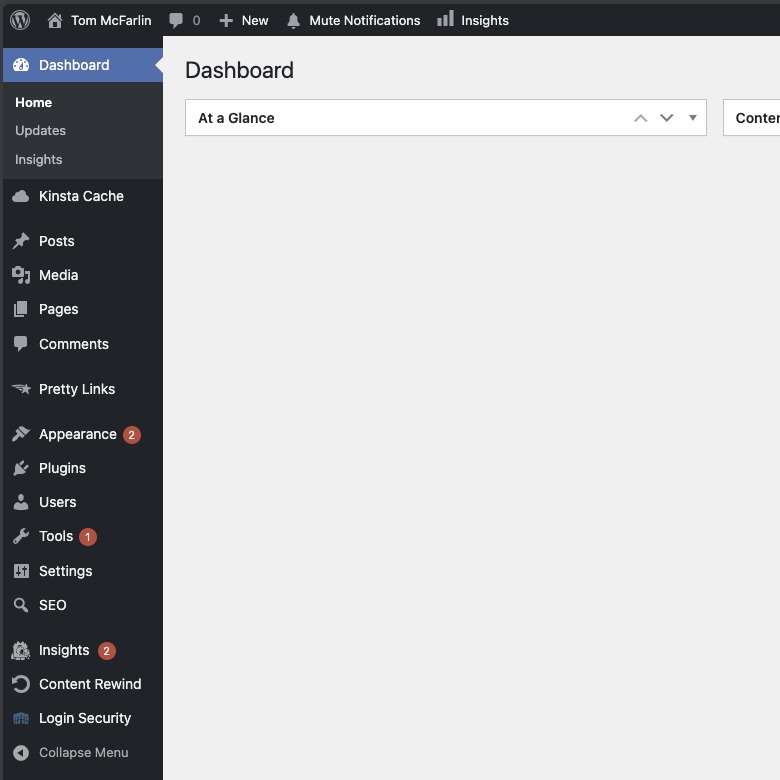
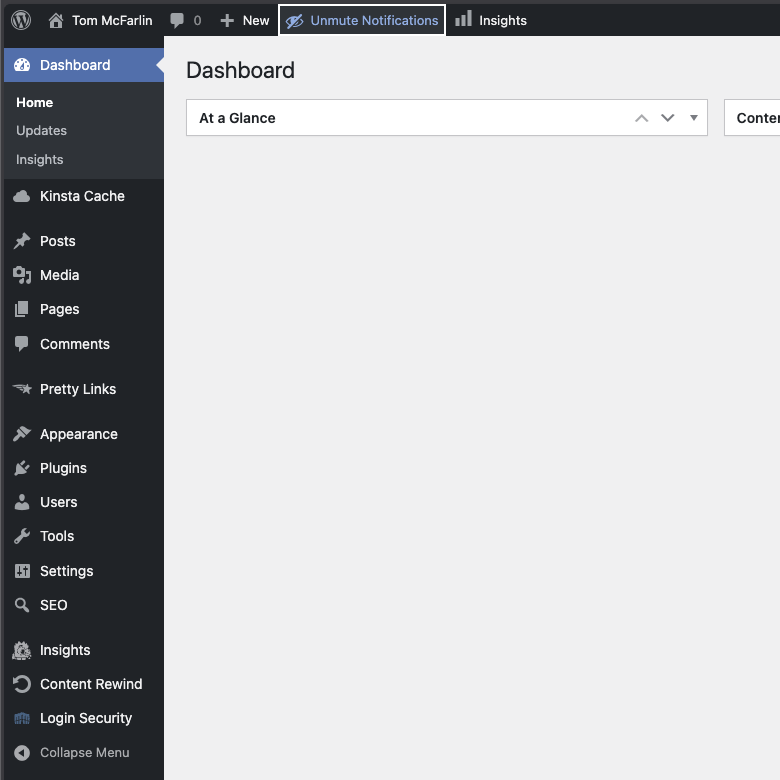

# Mute Menu Notifications


Silence distracting update badges in the WordPress admin menu with a single click -- and bring them back whenever you're ready.

| Notifications visible | Notifications muted |
|---|---|
|  |  |

## Why?

If you've ever been in the middle of building something and found yourself distracted by a wall of red notification bubbles, this plugin is for you.

Maybe you're working on a staging site where the badge counts are meaningless noise. Maybe you're walking a client through their dashboard and would rather not field questions about why everything looks like it's on fire. Or maybe you just handle updates on your own schedule and don't need a constant reminder that three plugins want attention.

Mute Menu Notifications gives you a simple toggle in the admin bar. Click it, the badges disappear. Click it again, they come back. That's the whole plugin.

## Features

- **Instant toggle from the admin bar** -- no settings page, no configuration, no extra menu items
- **Per-user preference** -- each administrator controls their own mute state independently
- **Server-side rendering** -- badges are hidden via inline CSS in the document head, so there's no flicker on page load
- **Zero-config** -- activate the plugin and the toggle appears; deactivate and everything reverts
- **Accessible** -- ARIA attributes, keyboard navigation, and screen reader support built in
- **Lightweight** -- no external dependencies, no database tables, no options pages

## Requirements

- PHP 7.4 or later
- WordPress 6.9 or later

## Installation

### Using the WordPress Dashboard

1. Navigate to the "Add New" Plugin Dashboard.
2. Select `mute-menu-notifications.zip` from your computer.
3. Upload.
4. Activate the plugin on the WordPress Plugin Dashboard.

### Using FTP

1. Extract `mute-menu-notifications.zip` to your computer.
2. Upload the `mute-menu-notifications` directory to your `wp-content/plugins` directory.
3. Activate the plugin on the WordPress Plugins Dashboard.

### Git

1. Navigate to the `plugins` directory of your WordPress installation.
2. Run `git clone git@github.com:tommcfarlin/mute-menu-notifications.git`

## How It Works

Once activated, a "Mute Notifications" button appears in the admin bar for any user with the `update_plugins` capability (Administrators by default). Clicking the toggle hides the red update count bubbles on menu items like Plugins, Themes, and Updates, as well as the individual plugin update rows on the Plugins page.

The preference is stored as user meta and persists across sessions. The next time you log in, your mute state is right where you left it.

## Development

```bash
# Install dependencies
composer install

# Run tests
composer test

# Check coding standards
composer lint

# Auto-fix coding standards
composer lint:fix
```

## License

GPL-3.0 -- see [LICENSE](LICENSE) for details.
